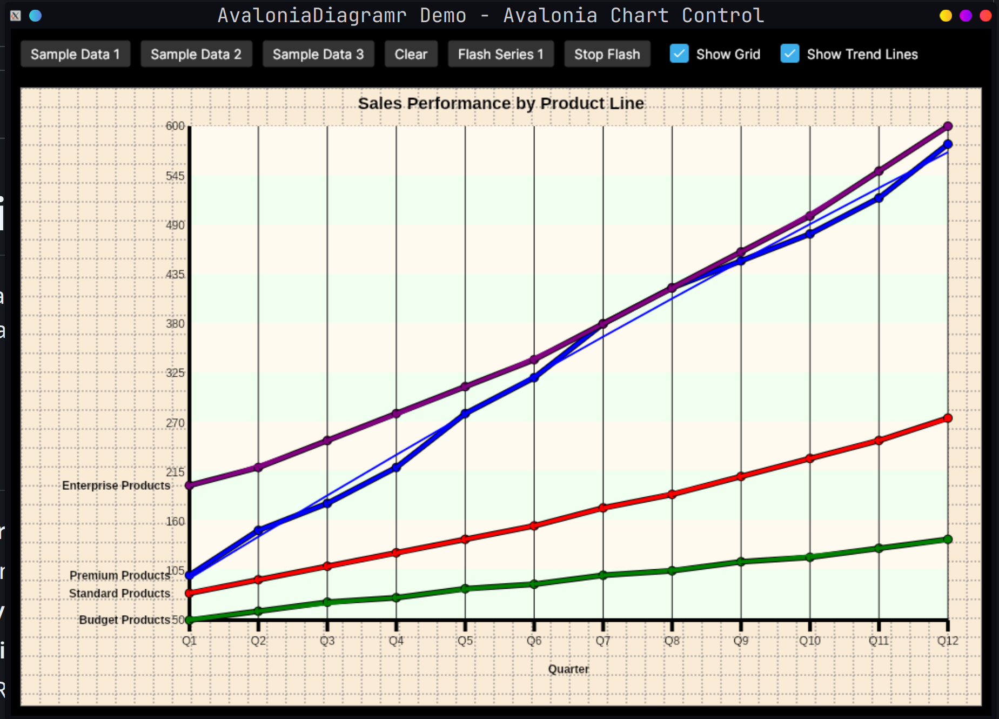

# AvaloniaDiagramerControl

A powerful, customizable multi-series line chart control for Avalonia UI applications. This control allows you to visualize multiple data series with trend lines, customizable styling, and interactive features.



## Features

- **Multiple Data Series**: Display up to 10 different data series simultaneously
- **Trend Lines**: Polynomial regression trend lines with configurable degree
- **Customizable Styling**: Full control over colors, fonts, line weights, and backgrounds
- **Interactive Flashing**: Highlight specific data series with animated flashing
- **Flexible Layout**: Responsive design that adapts to container size
- **Grid Support**: Optional grid overlay for easier data reading
- **Knot Markers**: Visual markers at data points
- **Alternating Backgrounds**: Improved readability with alternating background colors
- **Anti-aliasing**: Smooth, professional-looking lines

## Installation

1. Add a reference to `AvaloniaDiagramerControl.Controls` in your Avalonia project
2. Add the namespace to your AXAML file:
   ```xml
   xmlns:controls="clr-namespace:AvaloniaDiagramerControl.Controls;assembly=AvaloniaDiagramerControl.Controls"
   ```

## Basic Usage

### XAML Declaration

```xml
<controls:AvaloniaDiagramer x:Name="ChartControl"
                       ChartTitle="My Chart Title"
                       ChartTitleFontSize="18"
                       XAxisLabel="Month,Jan,Feb,Mar,Apr,May,Jun"
                       ShowGrid="True"
                       DrawKnots="True"
                       DrawRegressionTrendLines="True"
                       HorizontalAlignment="Stretch"
                       VerticalAlignment="Stretch"/>
```

### Adding Data Series

```csharp
// Clear existing data
ChartControl.ClearDataSeries();

// Set chart properties
ChartControl.ChartTitle = "Sales Performance";
ChartControl.XAxisLabel = "Quarter,Q1,Q2,Q3,Q4";

// Add data series (format: "Label,Value1,Value2,Value3,...")
ChartControl.AddDataSeries("Product A,100,150,180,220");
ChartControl.AddDataSeries("Product B,80,95,110,125");
ChartControl.AddDataSeries("Product C,50,60,70,75");

// Refresh the display
ChartControl.InvalidateVisual();
```

### Customizing Colors

```csharp
// Set individual data line colors (0-9)
ChartControl.SetDataLineColor(0, Colors.Blue);
ChartControl.SetDataLineColor(1, Colors.Red);
ChartControl.SetDataLineColor(2, Colors.Green);

// Toggle visibility of data lines
ChartControl.SetDrawDataLine(0, true);  // Show line 0
ChartControl.SetDrawDataLine(1, false); // Hide line 1
```

### Flashing a Data Series

```csharp
// Flash the first data series (index 0)
ChartControl.FlashDataLine = 0;

// Set custom flash color
ChartControl.FlashSeriesColor = Colors.Yellow;

// Stop flashing
ChartControl.FlashDataLine = -1;
```

## Public API Reference

### Properties

#### Chart Appearance

| Property | Type | Default | Description |
|----------|------|---------|-------------|
| `CanvasWidth` | int | 500 | Width of the chart canvas |
| `CanvasHeight` | int | 500 | Height of the chart canvas |
| `CanvasBackColor` | Color | AntiqueWhite | Background color of the entire canvas |
| `ChartBackColor` | Color | FloralWhite | Background color of the chart area |
| `ChartAlternateBackColor` | Color | Honeydew | Alternate background color for chart area |
| `ShowGrid` | bool | true | Show/hide the background grid |
| `ShowBorder` | bool | true | Show/hide the border |
| `AntiAlias` | bool | true | Enable/disable anti-aliasing for smooth lines |

#### Chart Title

| Property | Type | Default | Description |
|----------|------|---------|-------------|
| `ChartTitle` | string | "Sample Title" | The main chart title |
| `ChartTitleColor` | Color | Black | Color of the chart title |
| `ChartTitleFontFamily` | string | "Arial" | Font family for the chart title |
| `ChartTitleFontSize` | double | 15 | Font size for the chart title |
| `ChartTitleFontStyle` | FontStyle | Normal | Font style for the chart title |
| `ChartTitleFontWeight` | FontWeight | Bold | Font weight for the chart title |

#### Axis Configuration

| Property | Type | Default | Description |
|----------|------|---------|-------------|
| `XAxisLabel` | string | "" | Comma-separated axis label and tick labels (e.g., "Month,Jan,Feb,Mar") |
| `AxisDrawColor` | Color | Black | Color of the axis lines |
| `AxisLineWeight` | double | 4 | Thickness of the axis lines |

#### Axis Fonts

| Property | Type | Default | Description |
|----------|------|---------|-------------|
| `YAxisFontFamily` | string | "Arial" | Font family for Y-axis values |
| `YAxisFontSize` | double | 14 | Font size for Y-axis values |
| `YAxisFontStyle` | FontStyle | Normal | Font style for Y-axis values |
| `YAxisFontWeight` | FontWeight | Normal | Font weight for Y-axis values |
| `XAxisFontFamily` | string | "Arial" | Font family for X-axis tick labels |
| `XAxisFontSize` | double | 14 | Font size for X-axis tick labels |
| `XAxisFontStyle` | FontStyle | Normal | Font style for X-axis tick labels |
| `XAxisFontWeight` | FontWeight | Normal | Font weight for X-axis tick labels |
| `AxisLabelFontFamily` | string | "Arial" | Font family for the axis label (main title) |
| `AxisLabelFontSize` | double | 12 | Font size for the axis label |
| `AxisLabelFontStyle` | FontStyle | Normal | Font style for the axis label |
| `AxisLabelFontWeight` | FontWeight | Bold | Font weight for the axis label |

#### Data Visualization

| Property | Type | Default | Description |
|----------|------|---------|-------------|
| `DrawKnots` | bool | true | Draw markers at data points |
| `DrawYAxisValues` | bool | true | Show Y-axis numeric values |
| `DrawLineWeight` | double | 4 | Thickness of data series lines |
| `OutlineDataSeries` | bool | true | Draw black outline around data lines |
| `ClearChartArea` | bool | true | Clear the chart area before redrawing |

#### Chart Grid

| Property | Type | Default | Description |
|----------|------|---------|-------------|
| `ChartGrid` | bool | true | Enable/disable the chart grid |
| `ChartGridGranularity` | int | 10 | Grid granularity |

#### Trend Lines

| Property | Type | Default | Description |
|----------|------|---------|-------------|
| `DrawRegressionTrendLines` | bool | true | Show/hide polynomial regression trend lines |
| `TrendLineDegreeValue` | int | 2 | Degree of polynomial for trend line (1=linear, 2=quadratic, etc.) |
| `TrendLineWeight` | int | 2 | Thickness of trend lines |

#### Additional Features

| Property | Type | Default | Description |
|----------|------|---------|-------------|
| `DrawAlternateChartBackground` | bool | true | Use alternating background colors in chart area |
| `DrawIntervalDataSeriesIntersects` | bool | true | Draw vertical interval lines |
| `FlashDataLine` | int | -1 | Index of data line to flash (0-9), -1 to disable |
| `FlashSeriesColor` | Color | Bright Red (#FF0000) | Color to use when flashing a data series |

### Methods

#### Data Management

```csharp
void AddDataSeries(string dataSeriesString)
```
Adds a data series to the chart. Format: "Label,Value1,Value2,Value3,..."

```csharp
void ClearDataSeries()
```
Removes all data series from the chart.

#### Color Management

```csharp
Color GetDataLineColor(int index)
```
Gets the color of the specified data line (0-9).

```csharp
void SetDataLineColor(int index, Color color)
```
Sets the color of the specified data line (0-9).

#### Visibility Management

```csharp
bool GetDrawDataLine(int index)
```
Gets whether the specified data line is visible (0-9).

```csharp
void SetDrawDataLine(int index, bool value)
```
Sets whether the specified data line should be drawn (0-9).

## Examples

### Example 1: Sales Performance Chart

```csharp
ChartControl.ClearDataSeries();
ChartControl.ChartTitle = "Sales Performance by Product Line";
ChartControl.XAxisLabel = "Quarter,Q1,Q2,Q3,Q4,Q5,Q6,Q7,Q8";

ChartControl.AddDataSeries("Premium Products,100,150,180,220,280,320,380,420");
ChartControl.AddDataSeries("Standard Products,80,95,110,125,140,155,175,190");
ChartControl.AddDataSeries("Budget Products,50,60,70,75,85,90,100,105");

ChartControl.InvalidateVisual();
```


### Example 2: Temperature Variations

```csharp
ChartControl.ClearDataSeries();
ChartControl.ChartTitle = "Temperature Variations Throughout the Year";
ChartControl.XAxisLabel = "Month,Jan,Feb,Mar,Apr,May,Jun,Jul,Aug,Sep,Oct,Nov,Dec";

ChartControl.AddDataSeries("City A,-10,-5,5,15,25,35,40,38,28,18,5,-8");
ChartControl.AddDataSeries("City B,0,3,10,18,28,32,35,33,26,16,8,2");
ChartControl.AddDataSeries("City C,20,22,25,28,32,35,38,37,33,28,24,21");

ChartControl.DrawRegressionTrendLines = true;
ChartControl.InvalidateVisual();
```


### Example 3: Custom Styling

```csharp
// Set custom colors
ChartControl.CanvasBackColor = Color.Parse("#2C3E50");
ChartControl.ChartBackColor = Color.Parse("#34495E");
ChartControl.ChartAlternateBackColor = Color.Parse("#2C3E50");
ChartControl.ChartTitleColor = Colors.White;
ChartControl.AxisDrawColor = Colors.White;

// Customize fonts
ChartControl.ChartTitleFontSize = 24;
ChartControl.ChartTitleFontWeight = FontWeight.Bold;
ChartControl.YAxisFontSize = 12;
ChartControl.XAxisFontSize = 12;

// Set data line colors
ChartControl.SetDataLineColor(0, Color.Parse("#3498DB")); // Blue
ChartControl.SetDataLineColor(1, Color.Parse("#E74C3C")); // Red
ChartControl.SetDataLineColor(2, Color.Parse("#2ECC71")); // Green

// Configure visualization
ChartControl.DrawKnots = true;
ChartControl.OutlineDataSeries = true;
ChartControl.DrawLineWeight = 3;
ChartControl.TrendLineWeight = 2;
```

### Example 4: Interactive Flashing

```csharp
// Flash a specific series to highlight it
private void HighlightSeries(int seriesIndex)
{
    // Set flash color to bright yellow
    ChartControl.FlashSeriesColor = Colors.Yellow;

    // Start flashing the series
    ChartControl.FlashDataLine = seriesIndex;
}

private void StopHighlight()
{
    // Stop flashing
    ChartControl.FlashDataLine = -1;
}
```

## Demo Application

The included demo application (`AvaloniaDiagramerControl.Demo`) showcases all the features of the control:

- Multiple sample datasets
- Interactive buttons to switch between different chart types
- Flash functionality demonstration
- Grid and trend line toggles
- Responsive layout

To run the demo:

```bash
cd AvaloniaDiagramerControl.Demo
dotnet run
```

## Architecture

### Data Format

Data series are provided as comma-separated strings:
- First value: Series label (displayed next to the first data point)
- Remaining values: Numeric data points

Example: `"Sales,100,150,200,250"`

### Supported Data Lines

The control supports up to **10 simultaneous data series** (indices 0-9), each with:
- Independent color customization
- Individual visibility toggle
- Default color palette (Blue, Red, Green, Purple, Cyan, Magenta, Yellow, ForestGreen, DeepPink, Gray)

### Trend Line Calculation

Polynomial regression trend lines are calculated using the `Regressor` class:
- Configurable polynomial degree (1 for linear, 2 for quadratic, etc.)
- Automatically fitted to each visible data series
- Rendered with thinner lines to distinguish from actual data

## Requirements

- .NET 9.0 or later
- Avalonia UI 11.0 or later

## License

This project is a port of the original VB.NET Windows Forms TAIDiagramer control to Avalonia UI.

## Contributing

Contributions are welcome! Please ensure:
- Code follows existing style conventions
- All public APIs are documented
- Changes are tested with the demo application

## Support

For issues, questions, or feature requests, please open an issue on the project repository.

---

**Note:** This is a line chart control specifically designed for trend visualization. For other chart types (bar, pie, scatter), consider alternative charting libraries.
